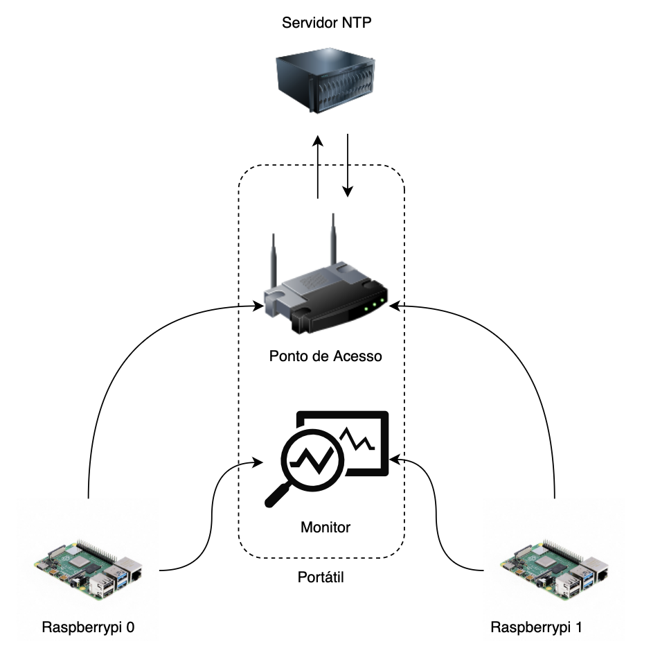

# real Semaphore Clock Syncronization

This project demonstrates the concept of traffic light synchronization using Raspberry Pi 4 devices. Multiple traffic lights, represented by individual Raspberry Pi 4s, are programmed to transition between RED and GREEN states without any direct communication between them. Each traffic light's decision is based solely on its internal timer. The synchronization is ensure by Network Time Protocol - NTP.

## Table of Contents

- [Installation](#installation)
- [Usage](#usage)
- [Testes](#tests)
- [Repository Organization](#repoOrganization)

## Installation
- Clone the git repository to a directory of your choice.
- Install missing libraries.

## Usage
- Connect the rasps to the same network by using the hotspot. 
- You need a device serving as a monitor, preferably the same as the one used in the hotspot
- Set as in figure bellow



- On the rasps run, where lado is the a boolean representing the side of the intersection (vertical, horizontal), NTPrate is an integer represent the Period of the NTP corrections update, servidor is the NTP server to be used (pool.ntp.org, localhost, etc) and Tciclo is an integer representing the periodicity os the change of state.

```bash
python3 NTPClient.py <lado> <NTPrate> <servidor> <Tciclo>
```
- On the monitor run:
```bash
python3 Monitor.py
```

## Tests

- 1<sup>st</sup> case study: no delay compensation

- 2<sup>nd</sup> case study: with delay compensation

- 3 experiments for each use case: rate & offset correction, offset correction, no correction

- To see the results go to data/ and run the matlab script plotData.m or see folder data/Resultados

## Repository Organization

- NTPClient.py
- Monitor.py
- data
  - parse_clock.py: script to parse the .txt data into a .csv generated by the clocks.
  - parse_clock.py: script to parse the .txt data into a .csv generated by the monitor.
  - plotData.m: MATLAB script is used to generate the results.
  - Resultados: This folder contains the results from the plotData.m. V1, V2, V3, V4 and proto are the different servers used to test.
- apresentacao: powerpoint presentation of the project.
- relatorio: detailed report of the project


```
project
│   README.md
│   Monitor.py
│   NTPClient.py 
│   NTPClientV1.py - old version
│
└───data - Results and data from experiences
│   │   V1/V2/V3/V4/proto - tested servers raw data
│   │   Resultados - Plots and figures
│   │
│   └───relatorio
│   │   SD_report.pdf - detailed report
│   │   SD_report_latex - latex report
│   │ 
│   └───apresentacao - powerpoint presentation
```
